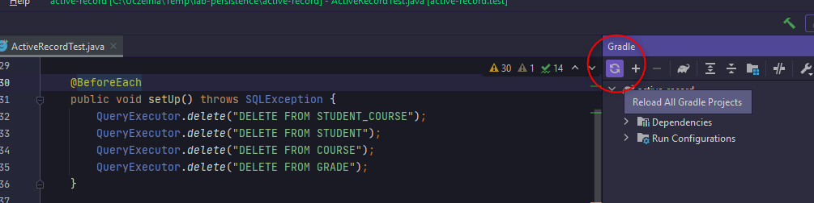
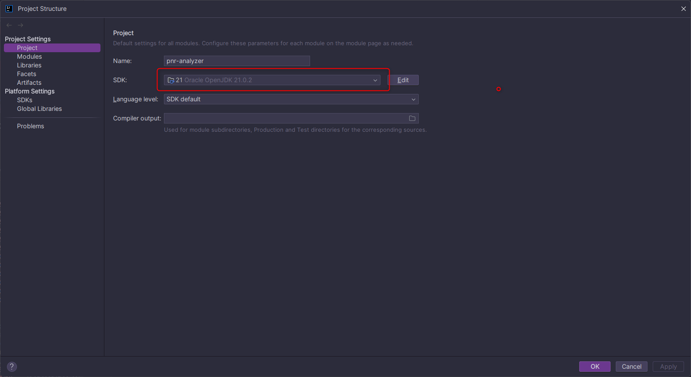
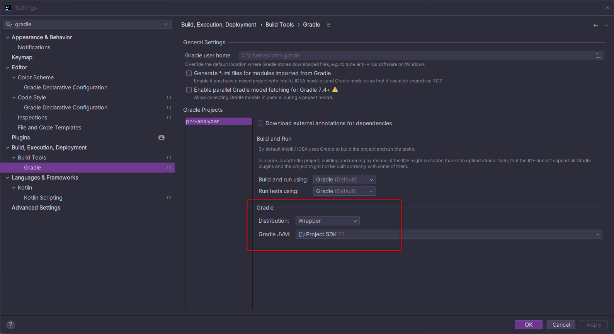
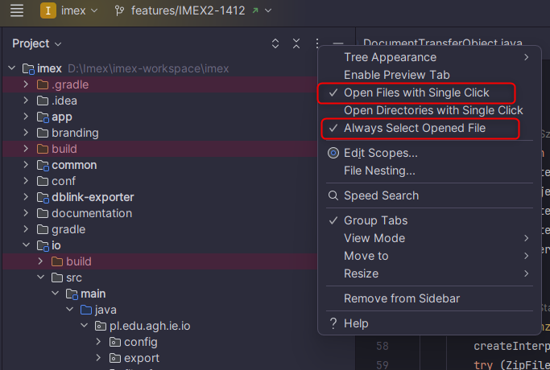

# IntelliJ - porady i konfiguracja

Podczas pracy na zajęciach będziemy używać [środowiska IntelliJ](https://www.jetbrains.com/idea) od firmy JetBrains. Należy pobrać najnowszą dostępną wersję, do której dostosowane zostały wszystkie treści w tym repozytorium.

### Wersja Ultimate dla studentów

Można korzystać z darmowej (ograniczonej) wersji IntelliJ lub użyć [studenckiego maila żeby aktywować wersję Ultimate](https://www.jetbrains.com/academy/student-pack). Na tych zajęciach zaawansowane funkcje Ultimate raczej nam się nie przydadzą, ale warto o tym pamiętać w kontekście projektów na kolejnych semestrach (np. dużo łatwiej pracuje się z bazami danych). Założenie i aktywacja konta JetBrains nie zajmuje dużo czasu.

### Typowe problemy

#### Projekt się nie kompiluje, IDE podkreśla kod na czerwono

W pierwszej kolejności zawsze warto odświeżyć projekt Gradle. IntelliJ automatycznie importuje konfigurację Gradle, ale jeśli coś w niej zmienimy musimy sami pamiętać by przeładować projekt:


#### LinkageError podczas uruchamiania aplikacji

Jeśli podczas uruchamiania aplikacji stworzonej w IntelliJ zobaczysz błąd tego typu:
```
Error: LinkageError occurred while loading main class agh.ics.oop.World
	java.lang.UnsupportedClassVersionError: agh/ics/oop/World has been compiled by a more recent version of the Java Runtime (class file version 65.0), this version of the Java Runtime only recognizes class file versions up to 61.0

```

...to oznacza, że najprawdopodobniej masz zainstalowaną więcej niż jedną wersję Javy. IntelliJ powinien wykryć wymaganą wersję na podstawie konfiguracji Gradle, ale czasem w wyniku zmian w projekcie ustawienia potrafią się wymieszać. W takiej sytuacji należy sprawdzić dwa miejsca, w których ustawiamy JDK (oba powinny wskazywać na to samo JDK w tej samej wersji):
1. Ustawienia (zębatka) -> *Project Structure* -> *Project*:
      
2. Ustawienia (zębatka) -> *Settings* -> *Build, Execution, Deployment* -> *Build Tools* -> *Gradle*
    
   
### Wsparcie AI

IntellliJ posiada wbudowane narzędzia do wspierania procesu pisania kodu. Można tam znaleźć zarówno AI Chat z dostępem do popularnych modeli LLM, jak i złożone narzędzie Junie do automatyzacji używania narzędzi IDE.
Oprócz tego w samym edytorze kodu pojawiają się maszynowo generowane sugestie - nie są one oparte o zapytania do LLM, a o wytrenowany model zbudowany w oparciu o analizę syntaktyczną kodu. 

Wszystkie te narzędzia mogą być w wielu sytuacjach bardzo pomocne, ale **nie zalecamy wykorzystywania któregokolwiek z nich podczas nauki programowania. Ponadto korzystanie z LLM do generowania rozwiązań zadań lub projektów może zostać potraktowane jako niesamodzielnie wykonana praca**. W trakcie semestru poznajemy elementarne zasady obiektowe, podstawy składni Javy i uczymy się pierwszy raz pisać większe kawałki kodu w projekcie. Oddawanie któregokolwiek z tych zadań sztucznej inteligencji sprawi, że w najlepszym wypadku nie utrwalicie poznanej wiedzy, a w najgorszym - w ogóle nie nabędziecie niezbędnych umiejętności, które będą Wam potrzebne w dalszym rozwoju, zarówno na studiach, jak i w pracy.
Narzędzia oparte o AI nie są złe same w sobie, ale należy ich używać dopiero, gdy osiągniemy już pewien poziom doświadczenia i będziemy potrafili efektywnie wyrażać swoje intencje i weryfikować rezultaty ich pracy.

Ta zasada dotyczy także przeklejania kodu znalezionego w Internecie - **warto przyjąć założenie, że nie używamy kodu, którego nie rozumiemy, z dokładnością do pojedynczych słów kluczowych czy metod**. Jeśli nie potrafilibyśmy sami (bez podglądania!) odtworzyć kodu, który znaleźliśmy to znaczy, że zastosowanie go nie jest dobrym pomysłem.

#### Jak wyłączyć wsparcie AI w kodzie?

O ile w przypadku modeli LLM wystarczy po prostu z nich nie korzystać, o tyle automatyczne podpowiedzi AI w IntelliJ są w aktualnej wersji włączone domyślnie. Dla własnego dobra i efektywności nauki silnie zalecamy ich wyłączenie. Aby to zrobić należy:
1. Otworzyć Ustawienia (ikona zębatki)
2. Przejść do sekcji Editor -> General -> Inline Completion
3. Odznaczyć checkbox *Enable local Full Line completion suggestions* i w razie potrzeby również *Enable cloud completion suggestions*

### Przydatne skróty i sztuczki

IntelliJ to bardzo rozbudowane IDE, które posiada mnóstwo narzędzi ułatwiających pracę i skracających najbardziej schematyczne i powtarzalne czynności. Wbrew pozorom w wielu sytuacjach nie jest potrzebne zaawansowane wsparcie AI - wystarczy nauczyć się kilku skrótów i być świadomym możliwości, jakie daje Wam IDE. 

Niektóre z tych narzędzi warto używać dopiero po zaznajomieniu się ze składnią Javy (podobnie jak w przypadku AI dobrze najpierw utrwalić sobie składnię i typowe konstrukcje takie jak gettery czy inicjowanie pól w konstruktorach). Jednak wiele z nich nie wpływa na sam proces nauki, a znacznie skraca czas pisania kodu (np. formatowanie, podpowiedzi dokumentacji metod, nawigacja).

Poniżej zebraliśmy najbardziej przydatne skróty na start (choć oczywiście jest ich znacznie więcej). Jeśli chcemy zmienić skrót klawiszowy lub całą keymapę to oczywiście też jest taka możliwość (patrz *Ustawienia (zębatka) -> Keymap*).

| Funkcja | Skrót klawiszowy | Gdzie znaleźć tę opcję? | Szczegóły |
| --- | --- | --- | --- |
| **Przeszukiwanie projektu** |
| Porządkowanie kodu | Ctrl + Alt + L | Menu główne → *Code* → *Reformat Code* | Formatuje kod zgodnie z ustawieniami formattera. |
| Wyszukiwanie zasobów | 2 x Shift | Menu główne → *Navigate* → *Search everywhere* | Wyszukuje klasy, pliki, metody, akcje po nazwach. Dodatkowa sztuczka: ogarnia początki słów w złożonych nazwach, np. wpisując ANCC dostaniemy szybko **A**dd**N**ew**C**olumn**C**ommand |
| Wyszukiwanie operacji | Ctrl + Shift + A | Menu główne → *Help*→ *Find action* | Wyszukuje dowolną operację lub ustawienie w IntelliJ. Np. wpisując "Gradle" możemy otworzyć okienko wywoływania taska gradle'owego, wpisując "presentation mode" możemy szybko włączyć tryb prezentacji, itp. |
| Listowanie metod w klasie | Ctrl + F12 | Menu główne → *Navigate* → *File structure* | Pokazuje listę wszystkich metod w klasie (z/bez odziedziczonych). Można też wyszukiwać po tej liście wpisując tekst (mimo że nie widać pola tekstowego). |
| **Nawigacja** |
| Przechodzenie po ostatnich miejscach w kodzie | Ctrl + Alt + → Ctrl + Alt + ← | Menu główne → *Navigate* → *Back / Forward* | Ustawia kursor na poprzednim / następnym miejscu w kodzie, które odwiedziliśmy podczas scrollowania, klikania po klasach itp. Bardzo przydaje się żeby szybko wędrować między odległymi miejscami bez klikania i szukania ich w otwartych plikach. |
| Przechodzenie do klasy/metody lub miejsc jej użycia | Ctrl + klik | Menu kontekstowe → *Find usages* | Skrót, który działa w zależności od kontekstu. Trzymając Ctrl i klikając w nazwę użytej metody możemy przejść do tej metody. Klikając w nazwę metody w miejscu gdzie jest ona zdefiniowana możemy wyświetlić jej wszystkie użycia (na te potrzeby można też skorzystać ze skrótu Alt+F7. |
| Pokazywanie hierarchii dziedziczenia | Ctrl + H | Menu główne → *Navigate* → *Type Hierarchy* | Otwiera okienko z hierarchią typów, w której występuje aktualnie otwarta klasa. |
| Otwieranie/zamykanie bocznych widoków | Alt + 1 / 2 / 3 / ... | Menu główne → *Tools* | Otwiera/zamyka boczne okienka, np. Alt+1 otwiera drzewo projektu. |
| **Refactoring** |
| Zmiana nazwy | Shift + F6 | Menu kontekstowe → *Refactor* → *Rename*... | Zmienia nazwę klasy/metody/atrybutu dbając o to by zmienić ją we wszystkich wystąpieniach w całym projekcie. |
| Stworzenie zmiennej/stałej/atrybutu/parametru | Ctrl + Alt + V, Ctrl + Alt + C, Ctrl + Alt + F, Ctrl + Alt + P | Menu kontekstowe → *Refactor* → *Introduce Variable / Constant / Field / Parameter* | Wyciąga na podstawie zaznaczenia nową zmienną (V), stałą (C), atrybut (F) lub parametr aktualnej metody (P). |
| Wydzielenie metody | Ctrl + Alt + M | Menu kontekstowe → *Refactor* → *Extract Method...* | Wydziela metodę na podstawie zaznaczonego fragmentu kodu. Żeby to zadziałało, zaznaczenie musi obejmować spójny kawałek kodu. IJ sam domyśli się, jakie powinny być parametry metody i typ zwracany. Oczywiście jeśli z danego fragmentu konieczne było zwrócenie więcej niż jednej wartości to również nie uda się wydzielić metody. |
| Generowanie typowych metod | Alt + Insert | Menu kontekstowe → *Generate..*. | Pozwala automatycznie dodać getter, settter, konstruktor, equals, hashcode itp. |
| Przenoszenie instrukcji w górę/w dół | Ctrl + Shift + ↑, Ctrl + Shift + ↓ | Menu główne → *Code* → *Move Statement Down/Up* | Przesuwa całą instrukcję (zwykle linijkę) w górę lub w dół nad poprzednią lub pod następną. |

#### Inne przydatne operacje

##### Automatyczne sugestie

To również skrót klawiszowy, ale mocno kontekstowy. W wielu sytuacjach po ustawieniu kursora na jakimś wyrażeniu możemy spytać IJ o sugestię skrótem **Alt + Enter**. Alternatywnie można też kliknąć na żółtą żarówkę, która często pojawia się obok. Nie zawsze te sugestie mają sens, ale czasem pozwalają coś uprościć lub zautomatyzować, np. zastąpić wyrażenie lambda przez method reference. 

##### Automatyczna nawigacja po drzewie plików

Domyślnie otwarcie pliku w edytorze IJ (np. w wyniku wyszukiwania) nie powoduje, że w drzewie plików widzimy miejsce, w którym znajduje się on w projekcie. Szczególnie przy przełączaniu się między wieloma plikami z różnych miejsc projektu jest to bardzo niewygodne. Dlatego warto ustawić sobie dwie opcje w menu z trzykropkiem przy drzewie projektu:

   
   
Pierwsza z nich zapewni szybkie przechodzenie po otwartych plikach klikając po drzewie projektu, a druga dodaje synchronizację podświetlenia aktualnie otwartego pliku w drzewie.

##### Tworzenie zmiennych/atrybutów w locie

Często gdy piszemy jakieś wyrażenie, chcemy je potem przypisać do zmiennej. Można oczywiście zacząć od razu od "Typ zmienna = ...", ale można to przyspieszyć pisząc od razu samo wyrażenie i dodając na końcu **".var"** - wtedy IJ zastosuje szablon i sam doda deklarację zmiennej.

W podobny sposób można przypisać coś do atrybutu - wtedy zamiast ".var" dopisujemy ".field".
Szczególnie przydaje się to w przypadku bardziej złożonych wyrażeń, np. streamów, gdzie możemy nawet na początku nie przewidzieć jaki będzie końcowy typ wyrażenia.