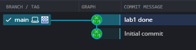
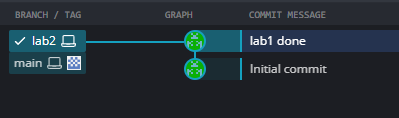
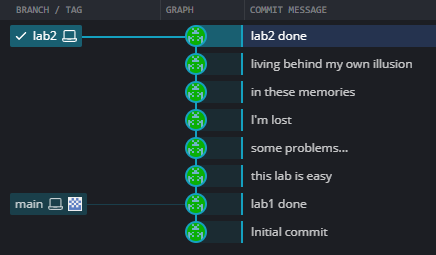
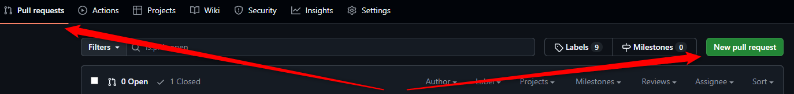
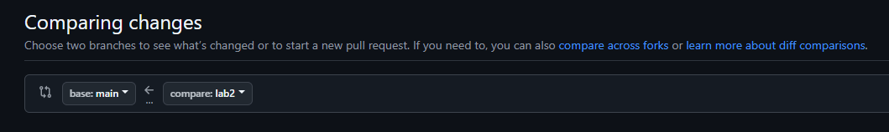
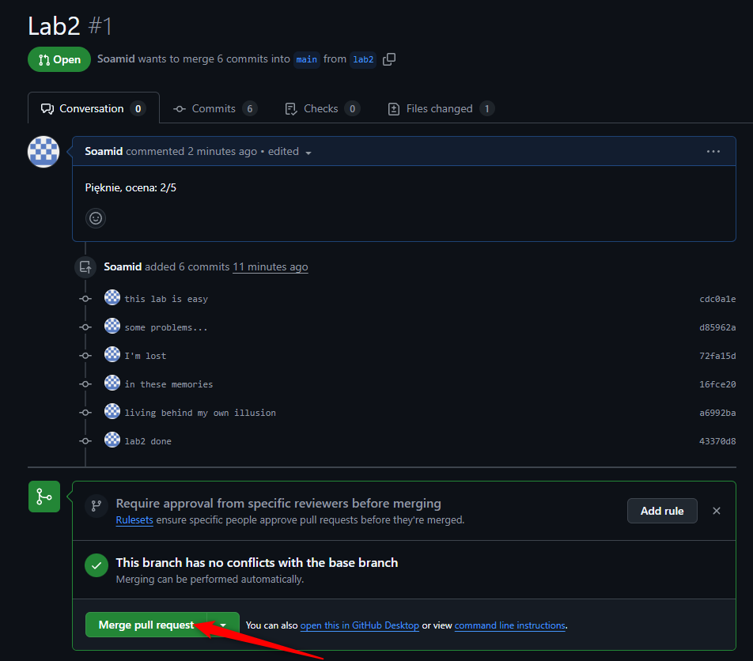
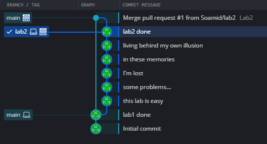
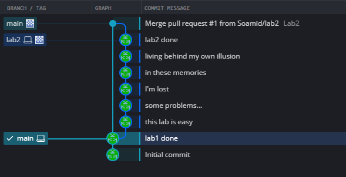
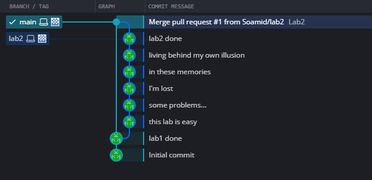
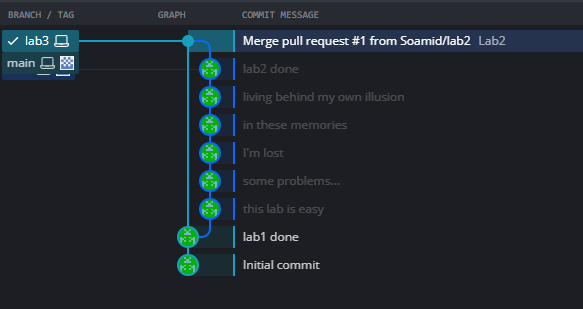

# Praca z Git na kolejnych laboratoriach

Aby zachować porządek i ułatwić przeglądanie kodu do oceny proponujemy sposób pracy oparty o tworzenie branchy dla każdego laboratorium i oddawanie Pull Requestów do oceny. System ten jest oparty o [GitHub Flow](https://docs.github.com/en/get-started/using-github/github-flow), czyli popularny workflow używany w wielu projektach. 

Wszystkie grafiki w poniższym przykładzie pochodzą z aplikacji GitKraken. Bardzo polecamy zwracać uwagę na graficzną postać logu Gita (za pomocą GitKraken lub dowolnego innego podobnego narzędzia). Pozwala to szybko wychwycić potencjalne problemy i zrozumieć, co dzieje się obecnie w repozytorium. Używanie komendy `git status` jest również pomocne, ale czasem może nie wystarczyć.

Zakładając, że mamy już za sobą jakieś zajęcia, nasze repozytorium może wyglądać na przykład tak:



1. Zaczynamy od utworzenia brancha. Możemy to zrobić zarówno z poziomu GitHuba (wówczas wystarczy potem przepiąć się lokalnie na utworzonego brancha) lub lokalnie:
    ```
    git checkout -b lab2
    ```
	Po utworzeniu i przepięciu się na nowego brancha repozytorium wygląda następująco:
	
	
1. Teraz możemy swobodnie pracować i rozwijać nasz kod. W zależności od preferencji możemy w określonych momentach wykonywać **commit** żeby utrwalać zmiany i ewentualnie **push** żeby przekazać je do zdalnego repozytorium na GitHubie. Mamy tutaj pełną swobodę, ale polecamy co jakiś czas utrwalać sobie zmiany na GitHubie (nawet traktując to jako formę backupu). 

	

	Warto zwrócić w tym miejscu uwagę, że główna gałąź (`main`) nadal wskazuje na miejsce, z którego utworzyliśmy brancha `lab2`. Jeśli przepniemy się na nią wszystkie nasze zmiany z `lab2` znikną. Nie jest to błąd i nie należy wówczas panikować, tylko wrócić na odpowiedniego brancha. :) A w razie głębszych problemów zawsze da się odnaleźć zaginiony `commit`, ponieważ Git przechowuje wszystko w lokalnej bazie danych (patrz polecenie [reflog](https://git-scm.com/docs/git-reflog)). 
1. W momencie, gdy chcemy oddać nasze rozwiązanie do oceny, musimy utworzyć Pull Request. Pamiętamy żeby wcześniej upewnić się, że wszystkie zmiany zostały przekazane do zdalnego repo (`git push`). Wchodzimy w tym celu na GitHuba i postępujemy zgodnie z instrukcjami:

	

	

	Ważne by PR zawsze był wynikiem porównania `main <- lab`. 

1. W zależności od ustaleń z prowadzącym czekamy na komentarze od niego lub pokazujemy PR w trakcie zajęć. Po otrzymaniu oceny możemy zamknąć PR na GitHubie i scalić branch z główną gałęzią `main`:

	
	
1. W tym momencie w logu naszego repozytorium lokalnego powinniśmy widzieć taką sytuację:

	

    Warto zauważyć, że nasz lokalny branch `main` nadal wskazuje na to samo miejsce, w którym go pozostawiliśmy na początku! Jest to bardzo ważne, ponieważ po przełączeniu się na niego (`git checkout main`) wciąż nie będą widoczne nasze zmiany z lab2. 

	
	
	Aby zobaczyć wszystkie zmiany należy po przełączeniu się na branch `main` zaktualizować jego stan, synchronizując go z branchem `origin/main` (ze zdalnego repozytorium na GitHubie), wykonując komendę:

	    git pull
	
	W tym momencie lokalny branch `main` będzie już wskazywał tam, gdzie zdalny `origin/main`:

		
	
1. Na tym etapie repozytorium jest już gotowe do kolejnej laborki - możemy utworzyć w tym miejscu branch `lab3` i cały cykl się powtarza:

		
