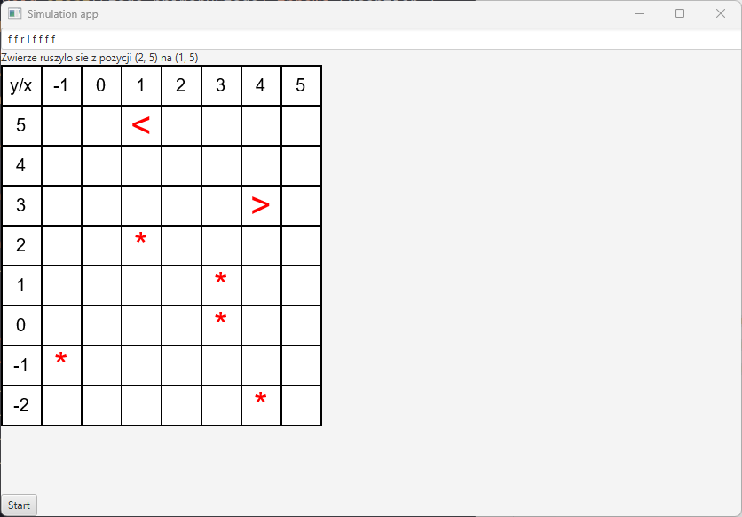

# Lab 8: Interfejs graficzny

Celem laboratorium jest wprowadzenie biblioteki graficznej **JavaFX** i zastosowanie jej do wyświetlania symulacji w prostej aplikacji okienkowej. 

Najważniejsze zadania:

1. Konfiguracja projektu (dodanie biblioteki JavaFX).
1. Przygotowanie wizualizacji w oparciu o wzorzec projektowy MVP.
1. Umożliwienie prostych interakcji - przycisk do uruchamiania symulacji z zadanymi parametrami.

## Zadania do wykonania (4xp)

### Szkielet aplikacji JavaFX

1. W `build.gradle`:

   2. Dodaj `id 'org.openjfx.javafxplugin' version '0.1.0'` do sekcji `plugins`.

   3. Dodaj pod `repositories` sekcję:

      ```gradle
      javafx {
          version = "21"
          modules = ['javafx.base', 'javafx.controls', 'javafx.fxml', 'javafx.graphics', 'javafx.media', 'javafx.swing', 'javafx.web']
      }
      ```

4. Odśwież konfigurację Gradle'a (`Ctrl+Shift+O`).

5. Utwórz klasę `SimulationApp` dziedziczącą z `Application` z pakietu `javafx.application`.

6. Zaimplementuj metodę `public void start(Stage primaryStage)`.

   * Będzie to metoda uruchamiająca interfejs graficzny Twojej aplikacji.
   * Na razie możesz w ciele metody wpisać `primaryStage.show();` W ten sposób nakazujemy aplikacji wyświetlić jedno, puste okno.

4. Stwórz dodatkową klasę `WorldGUI`, a w niej metodę `main`. Dodaj w niej instrukcję: `Application.launch(SimulationApp.class, args);`.

   * Spowoduje to uruchomienie okna JavaFX.
   * Możesz też zamiast tego zmodyfikować istniejącą metodę `main` w klasie `World`, jednak utworzenie nowej klasy będzie czytelniejsze.

4. Uruchom klasę `WorldGUI` i zobacz, czy okno się pokazuje (może być nieresponsywne, ale powinno się wyświetlić). 
   
   Pamiętaj by uruchamiać klasę, w której jest zdefiniowana metoda `main()` - uruchomienie samego `SimulationApp` technicznie jest możliwe, ale nie przy sposobie, który tutaj pokazujemy.
   
   **Uwaga:** Pamiętaj, żeby importować brakujące klasy z pakietu `javafx`, a nie innego (np. `awt`) - niektóre nazwy mogą być niejednoznaczne, bo w Javie jest kilka bibliotek graficznych.

### Wyświetlanie mapy w GUI (Wzorzec MVP)

1. Pobierz z folderu z konspektem plik `simulation.fxml` - opisuje on szkielet widoku okna aplikacji. Umieść go w zasobach projektowych, czyli w katalogu `src/main/resources` (jeśli nie widzisz katalogu `resources` - utwórz go i odśwież Gradle).

2. Przyjrzyj się pobranemu plikowi - w głównym tagu ma zdefiniowaną ścieżkę do tzw. kontrolera widoku (`agh.ics.oop.presenter.SimulationPresenter`). Jest to pojedyncza klasa, w której będzie można odwoływać się do widoku i jednocześnie porozumiewać się z modelem, który przygotowaliśmy na poprzednich zajęciach. **Stwórz tę klasę i umieść ją w odpowiednim pakiecie.**

3. Aby stworzyć instancję widoku i powiązanego z nim prezentera w oparciu o FXML, skorzystaj z `FXMLLoader`. W metodzie `SimulationApp.start()` umieść kod:
   ```java
   FXMLLoader loader = new FXMLLoader(); // zainicjowanie wczytywania FXML
   
   // wczytanie zasobu z katalogu resources (uniwersalny sposób)
   loader.setLocation(getClass().getClassLoader().getResource("simulation.fxml"));
   
   // Wczytanie FXML, konwersja FXML -> obiekty w Javie
   BorderPane viewRoot = loader.load();
   SimulationPresenter presenter = loader.getController();
   ```

4. Żeby wyświetlić widok, musisz powiązać go jeszcze z oknem aplikacji (`Stage`). W tym celu dodaj pomocniczą metodę i wywołaj ją dla `primaryStage` i `viewRoot`:
   ```java
   private void configureStage(Stage primaryStage, BorderPane viewRoot) {
	   // stworzenie sceny (panelu do wyświetlania wraz zawartością z FXML)
       var scene = new Scene(viewRoot);
       
       // ustawienie sceny w oknie
       primaryStage.setScene(scene);
       
       // konfiguracja okna
       primaryStage.setTitle("Simulation app");
       primaryStage.minWidthProperty().bind(viewRoot.minWidthProperty());
       primaryStage.minHeightProperty().bind(viewRoot.minHeightProperty());
   }
   ```

5. Po konfiguracji okienka wywołaj metodę `primaryStage.show()` i sprawdź, czy aplikacja działa - powinna teraz wyświetlać okienko z tekstem `All animals will be living here!`, zgodnie z opisem z FXML. 

6. Teraz musisz już tylko powiązać model z prezenterem. Do klasy `SimulationPresenter` dodaj atrybut `WorldMap` i setter `setWorldMap(WorldMap map)`. Samą mapę zainicjuj w `SimulationApp.start()` i podaj ją do prezentera przygotowanym setterem. Może być to dowolna mapa, np. prostokątna o racjonalnie niewielkim rozmiarze, np. 5x10. 

7. W prezenterze dodaj również metodę `drawMap()`. Docelowo będzie ona tłumaczyć mapę na postać siatki kontrolek. Na razie wystarczy, że ustawi ona zawartość mapy jako tekst wyświetlany zamiast dotychczasowego. W klasie prezentera możesz odwoływać się do wszystkich niezbędnych kontrolek z FXML. Jeśli przykładowo tag `Label` posiada identyfikator `fx:id="infoLabel"` to możesz w prezenterze utworzyć atrybut:
   ```java
    @FXML
    private Label infoLabel;
   ```

   ...a potem odwoływać się do niego w kodzie podczas wyświetlania mapy.

8. Kluczowe jest to, żeby każda kolejna zmiana mapy była wyświetlana w UI. W tym celu możemy **ponownie skorzystać z wzorca obserwator**. Używając istniejącego już mechanizmu zarejestruj `SimulationPresenter` jako kolejnego obserwatora dla mapy (`MapChangeListener`, użyj kodu z poprzednich zajęć). Metoda `mapChanged()` powinna wywoływać metodę `drawMap()`.

9. Przetestuj działanie aplikacji. Na potrzeby testów możesz np. dodać pojedyncze zwierzę do mapy w `SimulationApp`. Zastanów się, w którym miejscu należy wywołać metodę `place()` aby obserwator poprawnie zadziałał.
   Na tym etapie uruchomienie aplikacji powinno sprawić, że wyświetli okno z tekstową wersją mapy w stanie po dodaniu zwierzaka do mapy. Żeby umożliwić wizualizację pełnych symulacji konieczne będzie dodanie kilku interaktywnych elementów do aplikacji.

### Przyciski i interakcje

1. W pliku FXML dodaj dodatkowe kontrolki (możesz dowolnie układać layouty, korzystając z takich elementów jak `BorderPane`, `VBox`, `HBox`):

   - pole tekstowe (`TextField`) do wpisywania listy ruchów,
   - dodatkową etykietę `moveInfoLabel` (`Label`) do wypisywania opisu ruchu (przekazywanego do `mapChanged()`),
   - Przycisk z etykietą "Start" (`Button`), który posłuży do uruchamiania symulacji.

1. W przypadku pola z listą ruchów konieczne będzie podpięcie go w klasie prezentera - w ten sposób, wywołując metodę `textField.getText()` można dostać się do aktualnie wpisanych ruchów. Skorzystaj z `fx:id`, podobnie jak w przypadku `infoLabel`.

2. W przypadku przycisku możesz dodać w tagu FXML atrybut: `onAction="#onSimulationStartClicked"`. W ten sposób powiążesz z kliknięciem przycisku wywołanie metody `onSimulationStartClicked()` w prezenterze. Stwórz brakującą metodę.

3. W utworzonej metodzie startującej symulację stwórz obiekt `Simulation` w podobny sposób, jak na poprzednich laboratoriach. Skorzystaj z listy ruchów wpisanej przez użytkownika.

   **Uwaga 1**: Możesz założyć, że na mapie będą dwa zwierzęta i zainicjować ich pozycje w kodzie.

   **Uwaga 2**: Do przekształcenia stringa z ruchami na tablicę `String[]` możesz użyć metody `String.split()`.

4. W metodzie `mapChanged()` ustaw stan etykiety `moveInfoLabel` tak by pokazywała opis aktualnego ruchu.
5. Uruchom i przetestuj program. Prawdopodobnie już *prawie* działa. Zastanów się, jaki stan symulacji widzisz na ekranie i zapoznaj się z poniższym wyjaśnieniem. Następnie spróbuj poprawić aplikację. Symulacja powinna w pełni działać i wyświetlać animację prezentującą kolejne stany mapy. 

   **Uwaga o asynchroniczności:** JavaFX pracuje w swoim własnym, dedykowanym wątku, który cyklicznie rysuje aktualny stan kontrolek. Jeśli w tym samym wątku wywołamy dłuższą logikę, np. symulację, to UI będzie zajęty (zatnie się), dopóki symulacja się nie zakończy. Z tego względu konieczne jest wywoływanie symulacji asynchronicznie. Możesz tutaj skorzystać z `SimulationEngine` z poprzednich zajęć. Konieczne są tutaj dwa elementy:

   - Pauzy między kolejnymi ruchami symulacji - dodaj w odpowiednim miejscu `Simulation` wywołanie `Thread.sleep(500)`. Bez tego możesz nie zobaczyć kolejnych ruchów, bo symulacja wywoła się zbyt szybko. **Uwaga:** Metoda `sleep` może rzucić `InterruptedException`. Zastanów się, co z nim zrobić. 

   - Aktualizacja wątku UI - jeśli wywołasz metodę `drawMap()` z innego wątku niż wątek graficzny, dostaniesz błąd o treści `java.lang.IllegalStateException: Not on FX application thread`. TYLKO wątek graficzny może zmieniać kontrolki, dlatego konieczne jest zakolejkowanie takiego rysowania w wątku graficznym. Wystarczy w tym celu opakować rysowanie w ten sposób:
     ```java
     Platform.runLater(() -> {
         drawMap(worldMap);
          // ewentualny inny kod zmieniający kontrolki
     });
     ```

### Zaawansowana kontrolka do wyświetlania mapy

1. Do tej pory cała mapa wyświetlała się jako jeden String - to wciąż jedynie tekstowa postać mapy. Bardziej odpowiednią kontrolką do reprezentacji dwuwymiarowej mapy będzie [`GridPane`](http://tutorials.jenkov.com/javafx/gridpane.html).

2. Zdefiniuj nową kontrolkę typu `GridPane` w FXML i dodaj odpowiadający jej atrybut w prezenterze. 

3. Przekształć metodę `drawMap()` w taki sposób by za każdym razem:

   - czyściła aktualną siatkę,
   - tworzyła nową siatkę na podstawie aktualnych wymiarów mapy (użyj tutaj `WorldMap.getCurrentBounds()`).

   Do czyszczenia siatki możesz wykorzystać następujący kod:
   ```java
   private void clearGrid() {
       mapGrid.getChildren().retainAll(mapGrid.getChildren().get(0)); // hack to retain visible grid lines
       mapGrid.getColumnConstraints().clear();
       mapGrid.getRowConstraints().clear();
   }
   ```

4. Ustaw odpowiednie rozmiary kolumn i wierszy wywołując dla każdego z nich:
   ```java
   mapGrid.getColumnConstraints().add(new ColumnConstraints(CELL_WIDTH));
   mapGrid.getRowConstraints().add(new RowConstraints(CELL_HEIGHT));
   ```

5. Wyśrodkuj etykiety korzystając z wywołania `GridPane.setHalignment(label, HPos.CENTER)`.

6. Możesz pokazać linie siatki korzystając z atrybutu `gridLinesVisible="true"` dla `GridPane` (bezpośrednio w FXML lub w kodzie).

1. Aktualnie, twój program powinien wyglądać mniej więcej tak (użyto mapy `GrassField`, dodano 2 zwierzaki):
   

### Zadanie dodatkowe ()

Model naszej aplikacji umożliwia tworzenie nie jeden, a wielu działających równolegle symulacji. Zmodyfikuj kod aplikacji tak, by dało się uruchamiać i wyświetlać dowolnie dużo symulacji:

- Kliknięcie przycisku *Start* powinno wyświetlać symulację w nowym, osobnym okienku.
- Kolejne kliknięcie *Start* powinno otworzyć kolejne, nowe okienko z symulacją (z ewentualnymi nowymi argumentami).
- Symulacje powinny działać równocześnie (choć możesz tutaj zastosować wariant z pulą wątków - wtedy równocześnie będą działały np. 4, a pozostałe czekały, aż zwolni się zasób).

**Wskazówka:** w JavaFX możesz tworzyć dodatkowe obiekty `Stage` oraz wielokrotnie tworzyć obiekty `FXMLLoader`. Możliwe (i wskazane) jest też tworzenie osobnych plików `.fxml` dla osobnych widoków/okienek.

## Przydatne informacje

- JavaFX to [framework](https://pl.wikipedia.org/wiki/Framework) do obsługi środowiska graficznego.

* Aplikacja JavaFX składa się z:
  * `Stage` - okno aplikacji,
  * `Scene` - aktualna zawartość aplikacji (np. ekran symulacji, ekran podsumowania),
  * Scena zawiera wiele instancji `Node`. Są nimi m.in. przyciski, pola tekstowe, kontenery (`VBox`, `HBox`, `GridPane`, itp.).
* Główna klasa reprezentująca UI powinna dziedziczyć po `Application` i implementować metodę `start()`.
* Minimalna aplikacja powinna stworzyć jedną scenę, przypiąć ją do `Stage` i wyświetlić.
* Wyświetlanymi kontrolkami można zarządzać zarówno w kodzie, jak i w **plikach FXML** - podobnie jak HTML służą one do opisywania interfejsu graficznego w postaci drzewa tagów.
* [Model View Presenter (MVP)](https://anshul-vyas380.medium.com/model-view-presenter-b7ece803203c) to jeden z tzw. wzorców architektonicznych, podobny do klasycznego Model View Controller (MVC). Opisuje on nie tylko sposób modelowania pojedynczej interakcji czy struktury, a bardziej narzuca cały schemat architektury aplikacji. Zastosowanie takiego wzorca znacznie zwiększa czytelność i rozszerzalność kodu, poprzez separację warstwy wizualnej od warstwy modelowej.
  Wzorzec ten stosuje się często w połączeniu z innymi wzorcami projektowymi, np. obserwatorem (patrz przykład z naszej laborki).
