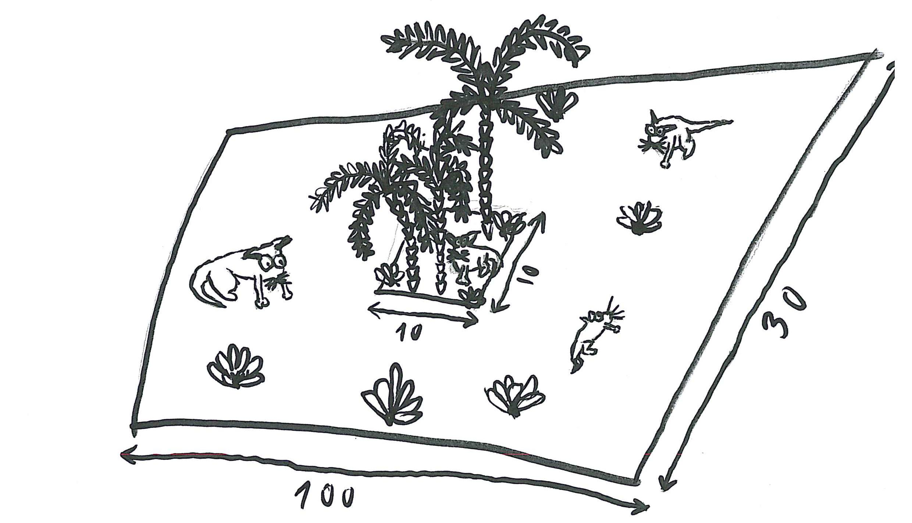
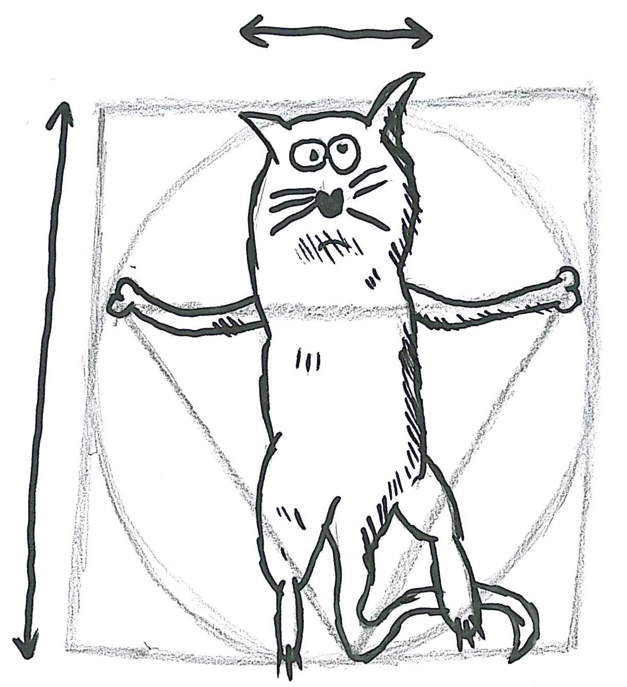
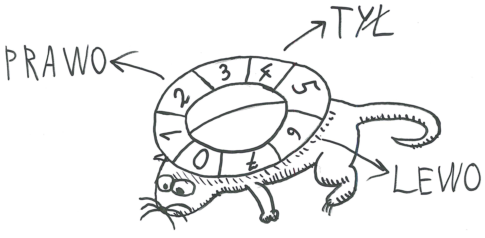

# Projekt: Darwin World

Niniejsza treść została zaadaptowana przez Aleksandra Smywińskiego-Pohla na podstawie opisu oraz ilustracji przygotowanych przez Wojciecha Kosiora. Inspiracją dla niego była z kolei książka "Land of Lisp" Conrada Barskiego, który zaś zainspirował się artykułem w "Scientific American". A na końcu modyfikacje wprowadził Radosław Łazarz, bazując częściowo na książce "Algorytmy genetyczne i ich zastosowania" Davida E. Goldberga. Aktualną wersję przeredagował i rozszerzył Michał Idzik.

## Cel projektu

Stwórzmy grę! Nie będzie to jednak gra, w którą my gramy. Zamiast tego będzie to świat, który ewoluuje na naszych oczach! Stworzymy środowisko stepów i dżungli ze zwierzakami, które biegają, buszują w zaroślach, jedzą i rozmnażają się. A po kilku milionach lat zobaczymy, że wyewoluowały w różne gatunki!

Świat naszej gry jest dość prosty. Składa się ze zwykłej, prostokątnej połaci podzielonej na kwadratowe pola. Większość świata pokrywają stepy, na których rośnie niewiele roślin stanowiących pożywienie zwierzaków. Niektóre rejeony porasta jednak dżungla, gdzie rośliny rosną dużo szybciej. Rośliny będą wyrastały w losowych miejscach, ale ich koncentracja będzie większa w dżungli niż na stepie.

Nasze zwierzaki, które są roślinożercami, będą przemierzały ten świat w poszukiwaniu pożywienia. Każdy zwierzak ma określoną energię, która zmniejsza się co dnia. Znalezienie i zjedzenie rośliny zwiększa poziom energii o pewną wartość.

## Anatomia zwierzaka

Musimy śledzić kilka cech każdego zwierzaka. Po pierwsze, zarówno w przypadku rośliny jak i tych, którzy je zjadają, musimy znać koordynaty `x` i `y`. Wskazują nam one, gdzie dany zwierzak lub roślina jest na mapie.

Musimy także wiedzieć, ile energii ma dany zwierzak. To darwinowska gra o przetrwanie, więc jeśli zwierzak nie zdoła zdobyć odpowiedniej ilości pożywienia, będzie głodować i zdechnie...  Energia mówi nam o tym, ile dni funkcjonowania zostało jeszcze danemu zwierzakowi. Musi ono koniecznie znaleźć więcej jedzenia, zanim jej zapas się wyczerpie.

Musimy również pamiętać, w którą stronę zwierzak jest zwrócony. Jest to ważne, ponieważ każdego dnia będzie ono poruszać się na mapie w tym właśnie kierunku. Istnieje osiem różnych możliwych pozycji i tyle samo możliwych obrotów. Obrót `0` oznacza, że zwierzak nie zmienia swojej orientacji, obrót `1` oznacza, że zwierzak obraca się o 45°, `2`, o 90°, itd. Przykładowo: jeśli zwierzak był skierowany na północ i obrót wynosi `1`, to zwierzak skierowany jest teraz na północny wschód.

Na koniec musimy także przechowywać geny zwierzaka. Każdy zwierzak ma N genów, z których każdy jest jedną liczbą z zakresu od `0` do `7`. Geny te opisują (w bardzo uproszczony sposób) schemat zachowania danej istoty. Egzystencja naszych zwierzaków ma cykliczną naturę. Każdy z nich przechowuje informację o tym, z którego fragmentu swojego genomu będzie korzystał najbliższego dnia. Podczas każdego ruchu zwierzak zmienia najpierw swoje ustawienie, obracając się zgodnie z aktualnie aktywnym genem, a potem porusza się o jedno pole w wyznaczonym kierunku. Następnie gen ulega dezaktywacji, a aktywuje się gen na prawo od niego (będzie sterował zwierzakiem kolejnego dnia). Gdy geny skończą się, to aktywacja wraca na początek ich listy. Przykładowo - genom:
`0 0 7 0 4`
oznacza, że żyjątko będzie kolejno: szło przed siebie, szło przed siebie, szło nieco w lewo, szło przed siebie, zawracało, szło przed siebie, ... - itd.

W domyślnym wariancie projektu mapa działa jak kula ziemska, tzn. po dotarciu do lewej krawędzi mapy, zwierzak wychodzi z prawej strony. Po dotarciu do jednego z biegunów (północnego lub południowego) odbija się od nich, zmieniając zwrot swojego wektora ruchu na przeciwny.

## Roślinność

Nowe rośliny pojawiają się na mapie każdego dnia. Lokalizacja nowych roślin jest losowa, ale z większym prawdopodobieństwem roślina pojawi się na preferowanym polu (dżungli). W domyślnym wariancie projektu dżungla to obszar zlokalizowany wokół równika. Równik definiujemy jako ciag rzędów mapy zlokalizowany w jej centrum. Zajmuje on 20% wysokości mapy. Zakładamy, że rozrost roślin działa zgodnie z zasadą Pareto: istnieje 80% szans, że roślina wyrośnie w dżungli, zajmującej 20% mapy.

## Konsumpcja i rozmnażanie

Jedzenie jest prostym procesem. Zakładamy, że zwierzak zjada roślinę, gdy stanie na jej polu, a jego energia wzrasta wtedy o z góry zdefiniowaną wartość.

Rozmnażanie jest zwykle najciekawszą częścią każdej symulacji ze zwierzakami. Zdrowe młode może mieć tylko zdrowa para rodziców, dlatego nasze zwierzaki będą się rozmnażać tylko jeśli mają odpowiednią ilość energii. Przy reprodukcji rodzice tracą na rzecz młodego pewną część swojej energii - ta energia będzie rónocześnie stanowić startową energię ich potomka.

Urodzone zwierzę otrzymuje genotyp będący krzyżówką genotypów rodziców. Udział genów jest proporcjonalny do energii rodziców i wyznacza miejsce podziału genotypu. Przykładowo, jeśli jeden rodzic ma 50, a  drugi 150 punktów energii, to dziecko otrzyma 25% genów pierwszego oraz 75% genów drugiego rodzica. Udział ten określa miejsce przecięcia genotypu, przyjmując, że geny są uporządkowane. W pierwszym kroku losowana jest strona genotypu, z której zostanie wzięta część osobnika silniejszego, np. *prawa*. W tym przypadku dziecko otrzymałoby odcinek obejmujący 25% *lewych* genów pierwszego rodzica oraz 75% *prawych* genów drugiego rodzica. Jeśli jednak wylosowana byłaby strona *lewa*, to dziecko otrzymałoby 75% *lewych* genów silniejszego osobnika oraz 25% *prawych* genów. Na koniec mają zaś miejsce mutacje: losowa liczba (wybranych również losowo) genów potomka zmienia swoje wartości na zupełnie nowe.

## Symulacja

Symulacja każdego dnia składa się z poniższej sekwencji kroków:

1. Usunięcie martwych zwierzaków z mapy.
2. Skręt i przemieszczenie każdego zwierzaka.
3. Konsumpcja roślin, na których pola weszły zwierzaki.
4. Rozmnażanie się najedzonych zwierzaków znajdujących się na tym samym polu.
5. Wzrastanie nowych roślin na wybranych polach mapy.

Daną symulację opisuje szereg parametrów:

* wysokość i szerokość mapy,
* wariant mapy (wyjaśnione w sekcji poniżej),
* startowa liczba roślin,
* energia zapewniana przez zjedzenie jednej rośliny,
* liczba roślin wyrastająca każdego dnia,
* wariant wzrostu roślin (wyjaśnione w sekcji poniżej),
* startowa liczba zwierzaków,
* startowa energia zwierzaków,
* energia konieczna, by uznać zwierzaka za najedzonego (i gotowego do rozmnażania),
* energia rodziców zużywana by stworzyć potomka,
* minimalna i maksymalna liczba mutacji u potomków (może być równa `0`),
* wariant mutacji (wyjaśnione w sekcji poniżej),
* długość genomu zwierzaków,
* wariant zachowania zwierzaków (wyjaśnione w sekcji poniżej).

## Wymagania dla aplikacji

Na potrzeby projektu każda para zakłada nowe repozytorium (prywatne!) o nazwie `PO_2025_[dzień][godzina]_[nazwisko1]_[nazwisko2]` i dodaje do niego swojego prowadzącego. 

Aplikacja ma być realizowana z użyciem graficznego interfejsu użytkownika z wykorzystaniem biblioteki JavaFX. Można skorzystać z kodu, przygotowanego podczas laboratorium i go rozwinąć. Nie jest dozwolone korzystanie z cudzych prac (z obecnej lub poprzednich edycji). Wykrycie niesamodzielnej pracy będzie traktowane jak plagiat i poskutkuje brakiem zaliczenia przedmiotu!

Wymagania projektu dzielimy na **część podstawową**, z którą można otrzymać **maksymalnie połowę punktów (16xp)** oraz rozszerzenia, które można dobrać w dowolnej ilości. Każde rozszerzenie daje określoną liczbę punktów. **Sumarycznie za cały projekt można otrzymać 32xp  (powiększone o ewentualne bonusy wynikające z zgromadzonych pietruszek).**. W przypadku zrealizowania rozszerzeń w sumie przekraczającej maksymalną liczbę punktów nadal można otrzymać maks. 32xp, ale przyznawana jest również dodatkowa **srebrna skrzynka**.

### Część podstawowa (maks. 16xp)

1. Umożliwienie uruchamiania symulacji o wybranych konfiguracjach.
   1. Konfiguracja to zestaw wartości parametrów opisanych powyżej. Każdy parametr można określić z poziomu interfejsu graficznego.
   1. Aplikacja powinna zapewniać domyślną konfigurację oraz możliwość zmiany parametrów.
   1. Niektóre z wariantów projektów wymagają zdefiniowania dodatkowych parametrów.
   1. Można założyć, że mapa ma określoną maksymalną wysokość i szerokość (tak by mieściła się sensownie na ekranie).

2. Uruchomienie symulacji powinno skutkować pojawieniem się nowego okna obsługującego daną symulację.

3. Sekcja symulacji ma wyświetlać animację pokazującą pozycje zwierzaków i innych obiektów na mapie tak, by dało się rozróżnić różne typy obiektów.

4. Program musi umożliwiać zatrzymywanie oraz wznawianie animacji w dowolnym momencie.

5. Program ma pozwalać na śledzenie następujących statystyk dla aktualnej sytuacji w symulacji:
   * liczby wszystkich zwierzaków,
   * liczby wszystkich roślin,
   * liczby wolnych pól,
   * najpopularniejszych genotypów,
   * średniego poziomu energii dla żyjących zwierzaków,
   * średniej długości życia zwierzaków dla martwych zwierzaków (wartość uwzględnia wszystkie nieżyjące zwierzaki - od początku symulacji),
   * średniej liczby dzieci dla żyjących zwierzaków (wartość uwzględnia wszystkie powstałe zwierzaki, a nie tylko zwierzaki powstałe w danej epoce).

6. Program powinien realizować wariant projektu wylosowany na pierwszych zajęciach. Wariant jest związany z alternatywnym przebiegiem symulacji i powinien być wybierany jako jeden z elementów konfiguracji. Opis wszystkich wariantów znajduje się w sekcji poniżej.

### Rozszerzenia (maks. 16xp)

 Można wybrać dowolne z podanej listy w dowolnej liczbie:

- Uruchamianie wielu symulacji jednocześnie w osobnych okienkach **(+2xp)**
- Wizualizowanie energii zwierzaków (np. kolor/pasek pod obiektem) na żywo w trakcie symulacji **(+2xp)**
- Zapisywanie i wczytywanie konfiguracji symulacji do pliku oraz zapewnienie listy "presetów" **(+2xp)**
- Podglądanie statystyk danego zwierzaka **(+3xp)**
  Po zatrzymaniu symulacji można zaznaczyć zwierzaka jako wybranego do śledzenia. Od tego momentu (do zatrzymania śledzenia) UI powinien przekazywać nam informacje o jego statusie i historii:
  - jaki ma genom,
  - która jego część jest aktywowana,
  - ile ma energii,
  - ile zjadł roślin,
  - ile posiada dzieci,
  - ile posiada potomków (niekoniecznie będących bezpośrednio dziećmi),
  - ile dni już żyje (jeżeli żyje),
  - którego dnia zmarło (jeżeli żywot już skończyło).
- Wyróżnianie wizualne zwierzaków z dominującym (najpopularniejszym) genotypem oraz pozycji preferowanych przez rośliny **(+2xp)**
- Zapisywanie statystyk symulacji do pliku CSV po każdym dniu **(+2xp)** - plik powinien być możliwy do otworzenia np. w Excelu w celu wizualizacji przebiegu wartości danej statystyki.
- Wizualizacja wybranej statystyki na wykresie, zmieniającym się w trakcie symulacji **(+2xp)** - ważne, by dało się określić w aplikacji, którą statystykę śledzimy (np. średnia energia zwierzaków albo średnia długość życia)
- Skalowanie rozmiaru mapy w zależności od rozmiaru **(+2xp)** - np. mapa o dużych wymiarach powinna mieć bardziej zagęszczoną wizualnie siatkę.
- Przewijanie krokowe symulacji w przód i w tył **(+3xp)**
- Własny, **zaakceptowany przez prowadzącego** pomysł **(+2xp)**

## Ocenianie

Podczas oceniania uwzględniane będą następujące czynniki:
1. Funkcjonalność - kompletność programu i pokrycie wszystkich wymagań, a także (przynajmniej minimalnie przyzwoita) ergonomia interfejsu użytkownika.
2. Kod programu 
   - Architektura - dekompozycja problemu, projekt modelu aplikacji, zastosowawnie wzorców projektowych;
   - Clean code - estetyka kodu, czytelność, stosowanie zasad SOLID, poprawne nazewnictwo itp;
   - Wydajność i techniczna realizacja - dobieranie odpowiednich narzędzi i algorytmów do problemów, prawidłowa obsługa wątków itp.
   - Obsługa błędów i zasobów zewnętrznych
   - Testy - powinny weryfikować przynajmniej kluczowe fragmenty logiki aplikacji

## Warianty projektu

Każdy zespół otrzyma od prowadzącego wariant projektu, który może wpływać na różne aspekty symulacji (np. typy obiektów na mapie, zachowanie roślinności itp). Projekt należy zrealizować tak, by dało się uruchomić symulację w wariancie podstawowym oraz w wariancie przydzielonym przez prowadzącego. Powinien być to element konfiguracji programu.

| Oznaczenie | Nazwa wariantu       | Opis                                                         | Parametry                                                    |
| ---------- | -------------------- | ------------------------------------------------------------ | ------------------------------------------------------------ |
| A          | Drapieżniki i Ofiary | Zwierzaki dzielą się na mięsożerne i roślinożerne. Zwierzaki mięsożerne (drapieżniki) zjadają inne zwierzaki o niższej energii (im większa różnica energii między zwierzakami, tym większa szansa, że drapieżnik pożre ofiarę, zamiast utworzyć z nią parę do rozmnażania). Zwierzaki roślinożerne mogą zjadać różne rodzaje roślin. W tym wariancie rośliny mogą mieć różną wielkość: każda roślina może dawać inną wartość energii. Zwierzaki nadal mogą się swobodnie rozmnażać. W szczególności jest możliwe skrzyżowanie roślinożercy z mięsożercą - gen potomka jest wówczas wybierany zgodnie z zasadami krzyżowania. | - zakres energii produkowanej przez rośliny - minimalna różnica energii, przy której drapieżnik może pożreć ofiarę |
| B          | Pory roku            | Wprowadzamy do naszego cyklu symulacji dwie pory roku: lato i zimę. Latem rośliny rosną częściej i produkują więcej energii. Zimą temperatura spada i zwierzaki próbują się ogrzać. Aby się ogrzać zwierzaki muszą znajdować się blisko siebie. W przeciwnym przypadku tracą więcej energii, w zależności od aktualnej temperatury. Na początku zimy temperatura zaczyna spadać, a po osiągnięciu minimalnej wartości stopniowo rośnie aż do zakończenia zimy. | - czas trwania każdej z pór roku - minimalna temperatura podczas zimy - odległość, w jakiej muszą się znajdować co najmniej 2 inne zwierzaki żeby zwierzak mógł się ogrzać |
| C          | Uprawianie ziemi     | Miejsca, przez które przechodzą zwierzaki o dużej energii, stają się żyzną glebą. Żyzność gleby rośnie z każdą taką wizytą i gdy osiągnie określoną wartość staje się polem preferowanym dla wzrostu roślin (dżunglą)  na określoną liczbę dni. Rośliny wyrastające na żyznej glebie są duże i starczają na wiele posiłków (wizyt zwierzaków).  W tym wariancie równik nie jest już dżunglą. | - minimalna energia zwierzaka potrzebna do uprawy ziemi - liczba dni, w trakcie których gleba jest żyzna - liczba użyć dużej rośliny |
| D          | Pożary               | Nieostrożne zwierzaki mogą z bardzo małym prawdopodobieństwem spowodować pożar zamiast zjeść roślinę. Pożar rozprzestrzenia się każdego dnia o 1 pole, jeśli w przylegających do niego polach znajdują się rośliny. Płonące rośliny wypalają się po kilku dniach i znikają.  Zwierzaki kończące dzień na płonącej roślinie zaczynają płonąć i przez określoną liczbę dni tracą na koniec dnia określoną ilość energii.  | - czas płonięcia rośliny/zwierzaka  - prawdopodobieństwo rozpalenia pożaru |
| E          | Trucizny i Odporność | Niektóre pola mapy generują toksyczne odmiany roślin, które po zjedzeniu zamiast dodawać energię, odejmują jej określoną część. Zwierzaki mogą wyewoluować genetyczną odporność na truciznę (losowo wybierana sekwencja genów na początku symulacji). Procentowa zgodność z tą sekwencją wpływa na procentową odporność na truciznę. | - prawdopodobieństwo, że nowa roślina będzie trująca - energia tracona po zjedzeniu trucizny - sekwencja genów dająca odporność |
| F          | Zapachy i Feromony   | Pola mapy posiadają tymczasowy, zanikający w czasie atrybut *feromonu*, związanego z udaną reprodukcją. Wartość atrybutu jest tym większa, im więcej zwierzaków dokonało reprodukcji na tym polu. Zwierzaki podczas swojego ruchu z pewnym prawdopodobieństwem zamiast wykonywać normalny ruch, kierują się w stronę pola o intensywniejszym zapachu, jeśli jest ono w zakresie ich węchu. | - Czas zanikania zapachu (liczba dni, po których wartość zapachu obniża się o 1) - Prawdopodobieństwo wykonania ruchu w stronę zapachu. - Zakres (promień) węchu zwierzaka. |
| G          | Szybkie zwierzaki    | Zwierzaki powyżej pewnego poziomu energii poruszają się nie o jedno, ale o więcej pól. Liczba pól jest proporcjonalna do nadwyżki energii względem prędkości normalnego zwierzaka. Jeśli w trakcie szybkiego ruchu zwierzak napotkałby po drodze rośliny, nie zjada ich, ale tratuje - takie rośliny znikają z mapy. Jeśli na drodze zwierzaka znajduje się inny zwierzak, nie można go przeskoczyć - zwierzak zatrzymuje się na takim polu. Jeśli zwierzak nie spowoduje kolizji, nie traci żadnej dodatkowej energii (szybki ruch kosztuje tyle samo, co normalny dzień). W przeciwnym przypadku traci podwójnie energię. | - poziom energii, przy którym zwierzaki zaczynają się szybko poruszać - ilość energii, po której następuje przyspieszenie o kolejny poziom (zasięg ruchu zwiększa się o 1)  - maksymalny zasięg szybkiego ruchu  |
| H          | Klątwa Habsburgów    | Zwierzaki posiadają atrybut płci biologicznej. Do rozmnażania od teraz potrzebny jest osobnik męski i żeński. Płeć dziecka stanowi dodatkowy gen, który ustalany jest na takich samych zasadach krzyżowania, jak w przypadku reszty genotypu.  Dzieci blisko spokrewnionych rodziców dziedziczą niższą bazową energię startową (podatność na wady wrodzone), co osłabia ich pozycję na starcie życia.  Stopień kary jest proporcjonalny do bliskości pokrewieństwa. | - startowa liczba żeńskich i męskich osobników. - strata energii dziecka blisko spokrewnionych zwierzaków (wyrażona jako % energii bazowej) |
| I          | Pasożyty             | Niektóre zwierzaki to pasożyty. Pasożyty nie spożywają roślin, zamiast tego szukają swojego żywiciela. Po spotkaniu normalnego zwierzaka pasożyt zaczyna za nim podążać. Przestaje decydować o swoim ruchu i jest automatycznie przesuwany na wolne pole obok normalnego zwierzaka (lub zajęte jeśli nie ma wolnego). Nie musi też zdobywać pożywienia - dostaje energię od swojego żywiciela. Normalny zwierzak zużywa dodatkową energię za każdego pasożyta, którego ze sobą ciągnie, a gdy umiera z wycieńczenia, pasożyty wpadają w panikę. Wykonują wtedy ruchy zgodne ze swoim genotypem, tracąc szybciej energię dopóki nie znajdą nowego żywiciela. Pasożyty mogą rozmnażać się podobnie jak inne zwierzaki, ale tylko z innymi pasożytami. | - startowa liczba pasożytów - energia tracona przez żywiciela na jednego pasożyta - energia tracona przez pasożyta, który stracił żywiciela |
| J          | FOMO                 | Zwierzaki cierpią na lęk przed wykluczeniem. Jeśli w pewnym promieniu znajduje się duże skupisko innych zwierzaków, osobnik ignoruje swoją strategię ruchu, spożywanie roślin i rozmnażanie i zamiast tego pędzi w środek tłumu, zakładając, że "tam na pewno dają darmową pizzę albo zwolnienie z egzaminu". Po dotarciu na miejsce (lub jeśli tłum się rozrzedzi wcześniej) zwierzak wraca do normalnych zwyczajów. Często kończy się to masowym wymieraniem głodowym w ścisku, mimo że dookoła rośnie pełno trawy. | - promień okręgu, w którym grupa zwierzaków może utworzyć tłum - liczba zwierzaków tworzących tłum  - maksymalna odległość od środka tłumu, przy której zwierzak zaczyna odczuwać efekt FOMO |

## FAQ

(A właściwie odpowiedzi na nie)

* Nowo narodzony (lub wygenerowany) zwierzak jest ustawiony w losowym kierunku. Ma też aktywowany losowy gen (niekoniecznie pierwszy).
* Narodzone dziecko pojawia się na tym samym polu co jego rodzice.
* UI nie musi pozwalać na wprowadzanie dowolnych wartości parametrów. Lepiej ograniczyć dopuszczalne zakresy (w szczególności do takich, które nie spowodują natychmiastowego zawieszenia aplikacji).
* Energię traktujemy całkowitoliczbowo. Pilnujemy jednak, by jej jedynym źródłem były rośliny (po rozmnażaniu się suma energii organizmów na danym polu powinna być taka sama jak przed rozmnażaniem).
* Jeżeli na jednym polu kilka zwierzaków rywalizuje o roślinę (albo o możliwość rozmnażania), to konflikt ten jest rozwiązywany w następujący sposób:
  - pierwszeństwo mają organizmy o największej energii,
  - jeżeli to nie pozwala rozstrzygnąć, to pierwszeństwo mają organizmy najstarsze,
  - jeżeli to nie pozwala rozstrzygnąć, to pierwszeństwo mają organizmy o największej liczbie dzieci,
  - jeżeli to nie pozwala rozstrzygnąć, to wśród remisujących organizmów wybieramy losowo.
* Rośliny mogą rosnąć tam, gdzie stoją zwierzaki. Zjadanie ma miejsce w momencie wchodzenia na pole. Potem zwierzak nie przeszkadza już w istnieniu rośliny.
* Nowe rośliny nie pojawiają się, jeżeli nie ma już dla nich miejsca na mapie.
* Statystyki nie muszą być prezentowane w formie wykresu (choć na pewno byłoby to ciekawe usprawnienie).
* Powyższa specyfikacja może różnić się trochę (lub bardzo) od analogicznych dokumentów znanych ubiegłym rocznikom. Zaleca się czujność i unikanie dróg na skróty. :)

# Przykładowe implementacje

Uwaga: przedstawione implementacje niekoniecznie spełniają tegoroczne wymagania.

* https://www.youtube.com/watch?v=4FangGEpwe4
